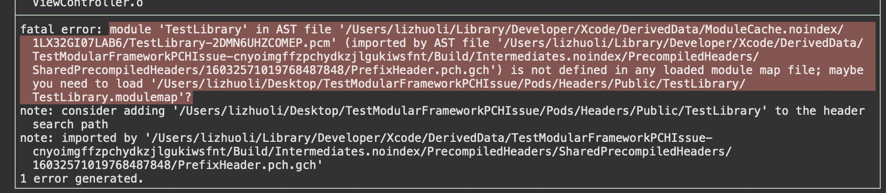

# CocoaPods Modular framework with precompiled headers issue


# What's for

It's a demo project to trigger the issue of CocoaPods. Which about the modular headers and precompieled headers. Testetd with `CocoaPods 1.6.0.rc.1`, still not been solved.

# Issue

When a Pod defines to use modular framework inside its podspec, like this:

```ruby
  s.pod_target_xcconfig = {
    'DEFINES_MODULE' => 'YES'
  }
```

Then you use this Pod, and import the Pods umbrella headers inside your pch files (prefix headers). Turn on the `Precompile Prefix Header` option of your build settings. 

And then, start build. However, you will see the compile error result like this.



# Reproduce

Clone this repo, run `pod install`, then run and see the compile failure result.

# Fix or workaround ?

Maybe there are one workaround way.

### Disable precompile prefix header:

You can use Xcode's build settings to disable this option. Or using `GCC_PRECOMPILE_PREFIX_HEADER = NO` in your xcconfig files.

~~### Don't use umbrella headers or modular import in pch files:~~

~~Import each frameworks's header files one by one, don't use any `@import` syntax or `#import <TestLibrary/TestLibrary.h>`~~

**Tested: This solution does not help.**

